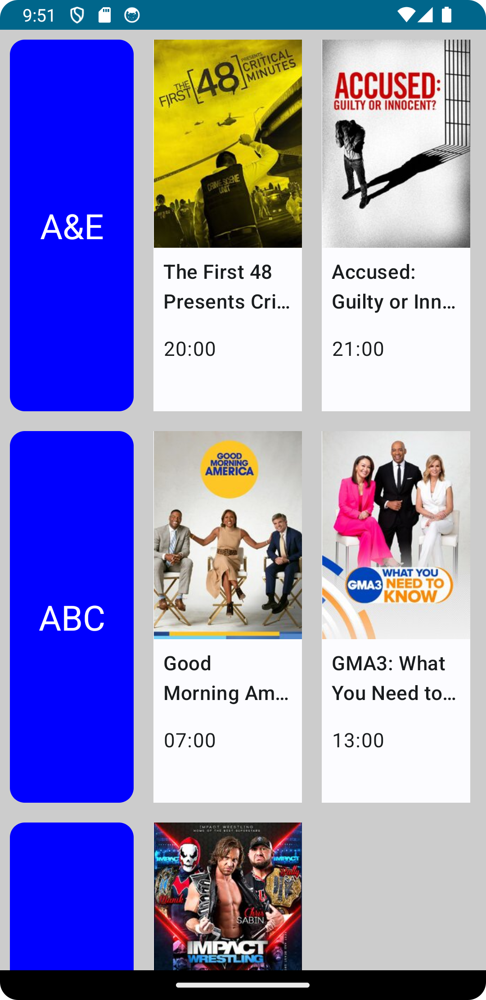

# TV Maze

TV Maze is an Android Compose app that allows you to schedule for your favorite TV shows and get detailed information about them.

## Features

- View show schedule
- View show details

## Prerequisites

- Android Studio

## Installation

1. Clone the repository:
2. Open the project in Android Studio.
3. Connect your Android device or start an emulator.
4. Build and run the app.

## API

This app uses the [TV Maze API](https://www.tvmaze.com/api) to fetch TV show data. The API provides information about shows, episodes, cast members, and more.

## License

This project is licensed under the [MIT License](LICENSE).

## Acknowledgments

- [TV Maze API](https://www.tvmaze.com/api) for providing the show data
- [Retrofit](https://square.github.io/retrofit/) for simplified HTTP networking
- [Glide](https://github.com/bumptech/glide) for image loading and caching
